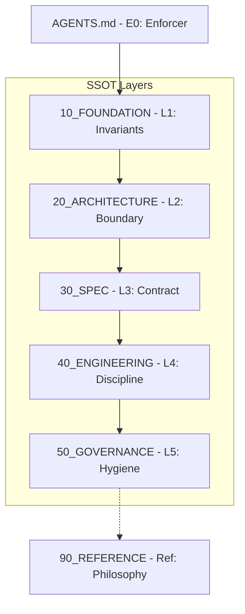

# Zipbul Documentation Index (문서 지도)

이 문서는 Zipbul 프로젝트의 모든 문서 구조와 위계를 안내하는 내비게이션 SSOT이다.

> 본 문서는 문서의 위치와 권위를 판정하기 위한 **내비게이션 SSOT**이며,
> 본문에 포함된 경로 및 계층 정보는 규범적이다.
> 단, 문서 내용 간 충돌 판정은 SSOT_HIERARCHY.md를 따른다.

---

## 1. 문서 시스템 위계 (Hierarchy)

모든 문서는 디렉토리 번호에 따라 권위 위계가 결정된다.  
번호는 **Authority Height + Recommended Reading Order**를 동시에 의미한다.  
상세 규칙은 [SSOT_HIERARCHY.md](10_FOUNDATION/SSOT_HIERARCHY.md)를 참조하라.

- **[AGENTS.md](../AGENTS.md) (E0)**: 행동 집행 (Out-of-Band)

1. **[10_FOUNDATION](10_FOUNDATION/)** (헌법): 시스템 불변식 및 용어 정의
2. **[20_ARCHITECTURE](20_ARCHITECTURE/)** (구조): 경계, 레이어, 의존성 원칙
3. **[30_SPEC](30_SPEC/)** (계약): 기능 명세 및 구현 제약
4. **[40_ENGINEERING](40_ENGINEERING/)** (규율): 스타일, 테스트, 도구 사용 규칙
5. **[50_GOVERNANCE](50_GOVERNANCE/)** (AI 거버넌스): 판단 기준 및 저장소 위생 규약
6. **[90_REFERENCE](90_REFERENCE/)** (참고): 철학 및 로드맵 (판정 기준 아님)

---

## 2. 주요 문서 바로가기

### 🏗️ 설계 및 구조

- [ARCHITECTURE.md](20_ARCHITECTURE/ARCHITECTURE.md): 시스템 아키텍처 및 레이어 의존성
- [STRUCTURE.md](20_ARCHITECTURE/STRUCTURE.md): 물리적 디렉토리 및 파일 배치 규칙
- [INVARIANTS.md](10_FOUNDATION/INVARIANTS.md): 시스템 전역 불변 조건

### 📜 기능 명세 (Spec)

- [SPEC.md](30_SPEC/SPEC.md): **최상위 기능 헌법 (모든 spec의 기준)**
- [30_SPEC/](30_SPEC/): `SPEC.md`에 종속된 개별 모듈/기능 계약 문서들

### 🛠️ 엔지니어링 가이드

- [STYLEGUIDE.md](40_ENGINEERING/STYLEGUIDE.md): 코딩 스타일 및 컨벤션
- [TESTING.md](40_ENGINEERING/TESTING.md): 테스트 전략 및 작성 규칙
- [VERIFY.md](40_ENGINEERING/VERIFY.md): 검증 절차 및 통과 기준
- [DEPENDENCIES.md](40_ENGINEERING/DEPENDENCIES.md): 외부 의존성 관리 정책

### ⚖️ AI 거버넌스 및 판단 기준

- [OVERVIEW.md](50_GOVERNANCE/OVERVIEW.md): 거버넌스 체계 개요
- [POLICY.md](50_GOVERNANCE/POLICY.md): 일반 판단 정책
- [DOCS_WRITING.md](50_GOVERNANCE/DOCS_WRITING.md): 전역 문서 작성 규율
- [SAFEGUARDS.md](50_GOVERNANCE/SAFEGUARDS.md): 에이전트 활동 보호 장치
- [COMMITS.md](50_GOVERNANCE/COMMITS.md): 커밋 메시지 및 브랜치 규칙
- [DEAD_CODE_POLICY.md](50_GOVERNANCE/DEAD_CODE_POLICY.md): 미사용 코드 관리 기준

### 📚 참고 및 비전 (비판정 영역)

- [VISION.md](90_REFERENCE/VISION.md): 프로젝트 핵심 가치 및 철학
- [ROADMAP.md](90_REFERENCE/ROADMAP.md): 향후 개발 로드맵
- [README.ko.md](90_REFERENCE/README.ko.md): 한국어 메인 문서

---

## 3. 상황별 문서 가이드

| 상황                         | 읽어야 할 문서                                     |
| :--------------------------- | :------------------------------------------------- |
| **작업 시작 전**             | [AGENTS.md (E0)](../AGENTS.md)                     |
| **새 패키지 / 구조 변경 시** | `ARCHITECTURE.md`, `STRUCTURE.md`, `INVARIANTS.md` |
| **기능 구현 시**             | `SPEC.md` → 관련 `*.spec.md` → `STYLEGUIDE.md`     |
| **테스트 작성 시**           | `TESTING.md`                                       |
| **CLI 사용/추가 시**         | `package.json` 스크립트 참조                       |
| **커밋 / 정리 전**           | `COMMITS.md`, `DEAD_CODE_POLICY.md`                |
